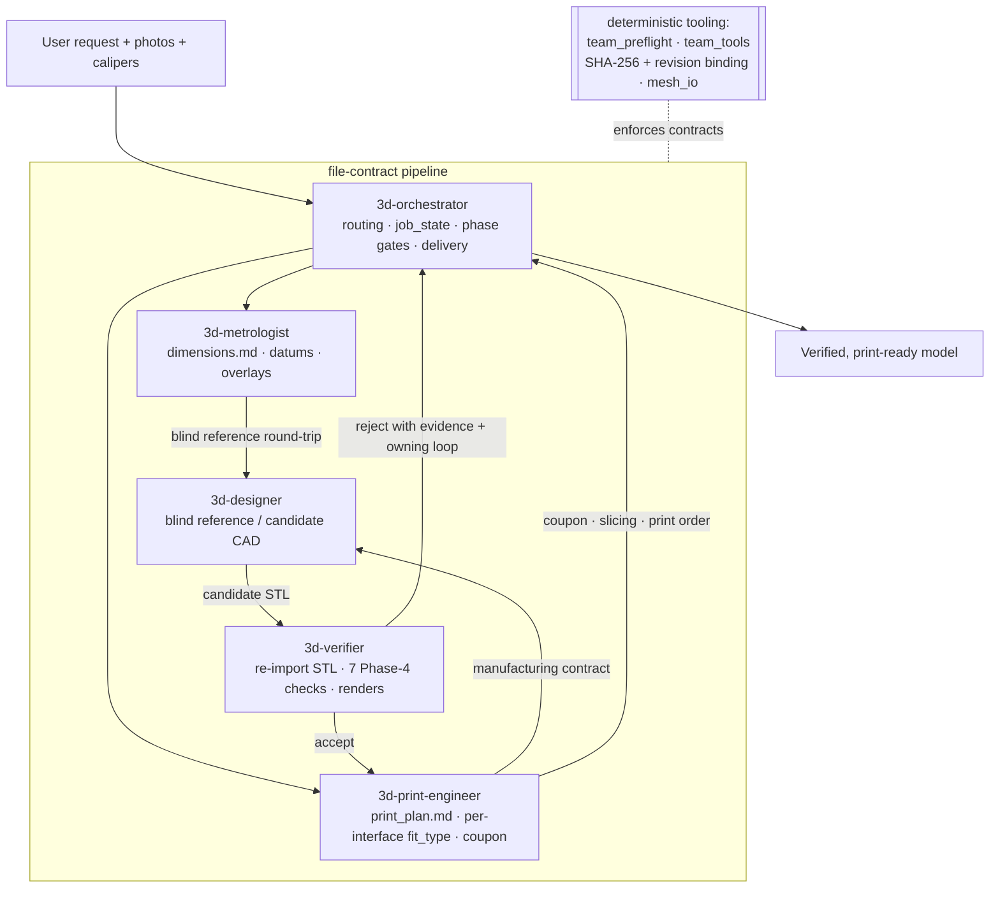

# 3d-modeling skill

A multi-agent, file-contract pipeline that turns a plain-language request plus
reference photos and caliper measurements into a **verified, print-ready 3D
model**. Five roles coordinate through contract files on disk, over deterministic
Python tooling that enforces contract structure, artifact identity, dependency
freshness, and repeatable geometric checks.

The guiding principle: **a passing software gate is necessary evidence, not proof
of correctness.** Agents own the engineering judgment — interpret photos, choose
datums, choose fit strategy, accept or reject a design. The tooling enforces only
what a machine can actually prove.

Nothing in the pipeline is harness-specific: the roles are defined once in
`skills/roles/` and generated into per-harness packaging, and every tool is a
plain Python CLI.

| Harness         | Role definitions                | Entry point                                     |
|-----------------|---------------------------------|-------------------------------------------------|
| [Claude Code](https://claude.com/claude-code) | `.claude/agents/3d-*.md`        | `/3d-orchestrator`, or `claude --agent 3d-orchestrator` |
| [OpenCode](https://opencode.ai)               | `.opencode/agents/3d-*.md`      | select `3d-orchestrator` as the primary agent   |
| generic / OpenAI-style                        | `dist/openai/3d-*.yaml`         | load the orchestrator manifest in your runtime  |

- **Normative contract + gate schema:**
  [`team-contracts-v4.md`](skills/3d-modeling/references/team-contracts-v4.md)
- **Tool reference:** [`docs/tooling.md`](docs/tooling.md) ·
  **Harness support:** [`docs/harness-matrix.md`](docs/harness-matrix.md)

## Quickstart

Start the orchestrator — in Claude Code, from a project that has a modeling job:

```
/3d-orchestrator
```

In OpenCode, select `3d-orchestrator` as the primary agent (Tab) and @-mention
specialists; in a generic runtime, load `dist/openai/3d-orchestrator.yaml`.

Give the orchestrator the request plus any reference photos and caliper reads. It
picks the pipeline profile, dispatches specialists, and gates each phase on the
contract files — see [Install](#install) if the agents are not discovered yet.

The contract-automation CLI also runs standalone on any project directory:

```bash
cd skills/3d-modeling/scripts
python -m team_tools.contracts validate ./team_tools/examples/project_ok
```

## How the pipeline works



Three properties make the verification mean something:

- Roles communicate **only** through project contract files and source evidence —
  never chat summaries.
- The designer and the verifier are always **different fresh contexts**. Nothing
  accepts its own work.
- The verifier runs every check on the **exported STL, re-imported** — not on the
  in-memory model that produced it.

## Install

### Dependencies

Core runtime — every contract and mesh tool, and all but the optional-backend
tests (see [Running the tests](#running-the-tests) for the two extra test-only
packages):

```bash
pip install trimesh numpy pillow manifold3d
```

Optional extras, declared in `pyproject.toml` and installed only for the
backends you actually use:

| Extra           | Pulls in                                          | Needed for                                              |
|-----------------|---------------------------------------------------|---------------------------------------------------------|
| `cad`           | cadquery (heavy OCP stack)                        | `run_cadquery_model.py`, CadQuery patterns              |
| `cad-build123d` | build123d (heavy OCP stack)                       | build123d backend + patterns                            |
| `section`       | scipy, networkx, shapely, rtree                   | `datum_features` / `finalize` datum blocks              |
| `render`        | pyrender, PyOpenGL                                | `preview.py` offscreen renders                          |
| `visual`        | pyrender, PyOpenGL, scipy, networkx, shapely, rtree | `overlay_photo.py`, `verify_visual.py`                |
| `bambu`         | lxml                                              | `make_bambu_3mf.py` (3MF authoring / verify)            |
| `mcp`           | mcp                                               | `tools/mcp_server.py` local stdio bridge                |

```bash
pip install -e ".[section]"   # or .[cad], .[visual], .[all], ...
```

The **FreeCAD** backend additionally needs a FreeCAD desktop install reachable
via the FreeCAD MCP; it is not a pip dependency.

### Harnesses

Opening *this* repo as your project is enough for any of the three: the
generated definitions are already in place. The rest of this section is about
using the roles from a *different* project.

**Claude Code** — auto-discovers agent definitions in a project's
`.claude/agents/`, exposing all five roles (`3d-orchestrator`, `3d-metrologist`,
`3d-designer`, `3d-verifier`, `3d-print-engineer`). Copy `.claude/agents/3d-*.md`
into that project's `.claude/agents/`, or into `~/.claude/agents/` for every
project, then symlink the skill folders as below.

**OpenCode** — reads `.opencode/agents/`, where `3d-orchestrator` is
`mode: primary` and the four specialists are `mode: subagent` with `task: deny`.
`opencode.json` attaches the deterministic tooling as the local MCP server
`3d-modeling-tools` (`python tools/mcp_server.py`). Project guidance comes from
the root [`AGENTS.md`](AGENTS.md), which is harness-neutral.

**Generic / OpenAI-style** — `dist/openai/3d-*.yaml` carries role metadata and
spawn capability per role. The manifests name capabilities only; the runtime
still calls the same repository CLIs, and should load `AGENTS.md` as repository
policy first. Bind MCP tools through your own runtime config.

All three are generated from `skills/roles/*.md` by `tools/gen_harness.py`, and
[`docs/harness-matrix.md`](docs/harness-matrix.md) records exactly what is
verified by tests versus documented-only for each — including the OpenCode
verification steps.

**Skills (Claude Code)** — place or symlink the skill folders under a discovered
`.claude/skills/` directory:

```bash
mkdir -p ~/.claude/skills
for s in 3d-modeling 3d-orchestrator 3d-metrologist 3d-designer 3d-verifier 3d-print-engineer; do
  ln -s "$PWD/skills/$s" ~/.claude/skills/$s
done
```

`3d-modeling` is in that list on purpose: the five role slices resolve their
shared assets by relative path (`../3d-modeling/references/...`,
`../3d-modeling/scripts/...`), so the shared folder has to sit beside them. It
holds no `SKILL.md` of its own and is not separately invocable — keep the
`skills/` subtree intact and do not flatten it.

## Repository layout

```
skills/
  3d-modeling/            # shared references, scripts, and backend adapters
    references/           #   FDM design, CadQuery/FreeCAD patterns, materials, printers, contracts
    scripts/              #   deterministic tooling + backend runners + tests
      team_tools/         #     contract-automation package (validate/hash/status)
      designer_toolkit/   #     export/measure/fit/coupon helpers for the designer role
  3d-orchestrator/        # \
  3d-metrologist/         #  |
  3d-designer/            #  |  five team role slices (each a SKILL.md)
  3d-verifier/            #  |
  3d-print-engineer/      # /
  roles/                  # neutral role sources — edit these, then regenerate
.claude/agents/3d-*.md    # Claude Code agent definitions   \
.opencode/agents/3d-*.md  # OpenCode agent definitions        > generated by tools/gen_harness.py
dist/openai/3d-*.yaml     # generic/OpenAI-style role metadata/
tools/                    # gen_harness · build_skill · check_internal_links · mcp_server
```

`skills/roles/*.md` are the source of truth for all three harness formats. Edit a
role there and run `python tools/gen_harness.py`; CI fails on drift.

## Running the tests

Tests and lint run on the core stack — no cadquery, no OCP, no GL context:

```bash
pip install ruff pytest PyYAML -e ".[mcp]"
ruff check skills/3d-modeling/scripts
pytest
```

`PyYAML` is needed because `tools/test_gen_harness.py` parses the generated
OpenAI-style YAML; the `mcp` extra adds the MCP server smoke test, which skips
without it. `pyproject.toml` puts `skills/3d-modeling/scripts` on `pythonpath`,
so the suites resolve their bare imports with no install step.

CI ([`.github/workflows/ci.yml`](.github/workflows/ci.yml)) runs that on Python
3.11 and 3.12, then `gen_harness.py --check`, `check_internal_links.py` and
`build_skill.py`. A second job installs `.[section]` and runs the cross-section
tests, which skip on the core stack.

## For agents

Hand this to a coding agent to install the skill into a project:

```text
Set up the 3d-modeling skill (https://github.com/ghsi011/3d-modeling-skill) for this project.

1. Clone it outside this project, e.g. `git clone https://github.com/ghsi011/3d-modeling-skill.git ~/src/3d-modeling-skill`. If the clone already exists, `git pull` instead.
2. Install the tooling dependencies as the clone's README "Dependencies" section specifies: the core install first, extras only for what this job actually needs.
3. Install the role definitions for the harness you are running under as the clone's README "Harnesses" section specifies, and say which harness you picked. Do not fabricate a config format the runtime does not document.
4. Read `docs/harness-matrix.md` in the clone and tell me which parts of your harness's support are verified by tests and which are documented-only.
5. Verify: `pip install pytest PyYAML` and run `pytest -q` inside the clone, report the pass/skip counts, then confirm `3d-orchestrator` is listed as an available agent here. Do not report success on an unverified step.

Then tell me: what you installed, what you skipped and why, and anything that failed. Do not guess versions or invent commands that are not in the repo's README or docs/tooling.md.
```

Once installed, the entry point is the orchestrator role — `/3d-orchestrator` in
Claude Code, the primary agent in OpenCode, the orchestrator manifest elsewhere.
Working notes for agents editing this repo live in [`AGENTS.md`](AGENTS.md); the
deterministic tool surfaces, their exact flags, and their exit-code contracts are
in [`docs/tooling.md`](docs/tooling.md).

## Changelog

See [CHANGELOG.md](CHANGELOG.md).

## License

[MIT](LICENSE) © 2026 Idan.
