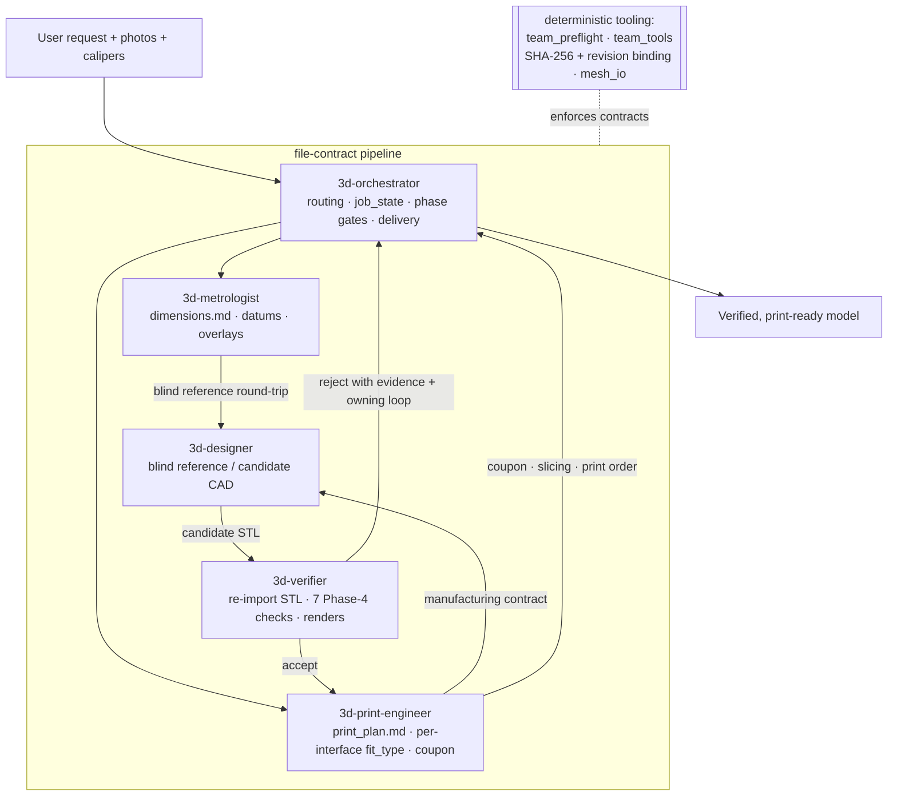

# 3d-modeling skill

A multi-agent, file-contract pipeline that turns a plain-language request plus
reference photos and caliper measurements into a **verified, print-ready 3D
model**. Five roles coordinate through contract files on disk, over deterministic
Python tooling that enforces contract structure, artifact identity, dependency
freshness, and repeatable geometric checks.

The guiding principle: **a passing software gate is necessary evidence, not proof
of correctness.** Agents own the engineering judgment — interpret photos, choose
datums, choose fit strategy, accept or reject a design. The tooling enforces only
what a machine can actually prove.

Nothing in the pipeline is harness-specific. It ships as **one skill**: the
orchestrator is the entry point and the four specialists are files it hands to
subagents, so any runtime that can spawn a subagent and read a file can run it.
Every tool is a plain Python CLI.

- **Normative contract + gate schema:**
  [`team-contracts-v4.md`](skills/3d-modeling/references/team-contracts-v4.md)
- **Tool reference:** [`docs/tooling.md`](docs/tooling.md)

## Quickstart

Invoke the skill — in Claude Code, from a project that has a modeling job:

```
/3d-modeling
```

The skill *is* the orchestrator: it dispatches the four specialists itself, by
handing each subagent the matching file from `roles/`. Any host that can spawn a
subagent works the same way — there is nothing to register per harness.

Give the orchestrator the request plus any reference photos and caliper reads. It
picks the pipeline profile, dispatches specialists, and gates each phase on the
contract files — see [Install](#install) if the agents are not discovered yet.

The contract-automation CLI also runs standalone on any project directory:

```bash
cd skills/3d-modeling/scripts
python -m team_tools.contracts validate ./team_tools/examples/project_ok
```

## How the pipeline works



Three properties make the verification mean something:

- Roles communicate **only** through project contract files and source evidence —
  never chat summaries.
- The designer and the verifier are always **different fresh contexts**. Nothing
  accepts its own work.
- The verifier runs every check on the **exported STL, re-imported** — not on the
  in-memory model that produced it.

## Install

### Dependencies

Core runtime — every contract and mesh tool, and all but the optional-backend
tests (see [Running the tests](#running-the-tests) for the two extra test-only
packages):

```bash
pip install trimesh numpy pillow manifold3d
```

Optional extras, declared in `pyproject.toml` and installed only for the
backends you actually use:

| Extra           | Pulls in                                          | Needed for                                              |
|-----------------|---------------------------------------------------|---------------------------------------------------------|
| `cad`           | cadquery (heavy OCP stack)                        | `run_cadquery_model.py`, CadQuery patterns              |
| `cad-build123d` | build123d (heavy OCP stack)                       | build123d backend + patterns                            |
| `section`       | scipy, networkx, shapely, rtree                   | `datum_features` / `finalize` datum blocks              |
| `render`        | pyrender, PyOpenGL                                | `preview.py` offscreen renders                          |
| `visual`        | pyrender, PyOpenGL, scipy, networkx, shapely, rtree | `overlay_photo.py`, `verify_visual.py`                |
| `bambu`         | lxml                                              | `make_bambu_3mf.py` (3MF authoring / verify)            |

```bash
pip install -e ".[section]"   # or .[cad], .[visual], .[all], ...
```

The **FreeCAD** backend additionally needs a FreeCAD desktop install reachable
via the FreeCAD MCP; it is not a pip dependency.

### Installing the skill

Opening *this* repo as your project is enough. To use it from another project,
copy or symlink the one skill folder where Claude Code discovers skills:

```bash
mkdir -p ~/.claude/skills
ln -s "$PWD/skills/3d-modeling" ~/.claude/skills/3d-modeling
```

The orchestrator is the skill; the four specialists are files in its `roles/`
directory that the orchestrator hands to subagents. Everything resolves inside
that one folder, so it installs and moves as a unit — `python tools/build_skill.py`
packs exactly this tree into `3d-modeling.skill`.

## Repository layout

```
skills/
  3d-modeling/            # THE skill: orchestrator + roles + shared assets
    references/           #   FDM design, CadQuery/FreeCAD patterns, materials, printers, contracts
    scripts/              #   deterministic tooling + backend runners + tests
      team_tools/         #     contract-automation package (validate/hash/status)
      designer_toolkit/   #     export/measure/fit/coupon helpers for the designer role
    SKILL.md              #   the orchestrator — the invocable entry point
    roles/                #   metrologist · designer · print-engineer · verifier
  roles/                  # neutral role sources — edit these, then regenerate
.claude/agents/3d-*.md    # Claude Code agent definitions   \
tools/                    # gen_harness · build_skill · check_internal_links · bench
```

`skills/roles/*.md` are the source of truth. Edit a role there and run
`python tools/gen_harness.py`; CI fails on drift.

## Running the tests

Tests and lint run on the core stack — no cadquery, no OCP, no GL context:

```bash
pip install ruff pytest -e "."
ruff check skills/3d-modeling/scripts
pytest
```

The `mcp` extra adds the MCP server smoke test, which skips without it. `pyproject.toml` puts `skills/3d-modeling/scripts` on `pythonpath`,
so the suites resolve their bare imports with no install step.

CI ([`.github/workflows/ci.yml`](.github/workflows/ci.yml)) runs that on Python
3.11 and 3.12, then `gen_harness.py --check`, `check_internal_links.py` and
`build_skill.py`. A second job installs `.[section]` and runs the cross-section
tests, which skip on the core stack.

## For agents

Hand this to a coding agent to install the skill into a project:

```text
Set up the 3d-modeling skill (https://github.com/ghsi011/3d-modeling-skill) for this project.

1. Clone it outside this project, e.g. `git clone https://github.com/ghsi011/3d-modeling-skill.git ~/src/3d-modeling-skill`. If the clone already exists, `git pull` instead.
2. Install the tooling dependencies as the clone's README "Dependencies" section specifies: the core install first, extras only for what this job actually needs.
3. Install the role definitions for the harness you are running under as the clone's README "Harnesses" section specifies, and say which harness you picked. Do not fabricate a config format the runtime does not document.
5. Verify: `pip install pytest` and run `pytest -q` inside the clone, report the pass/skip counts, then confirm `3d-orchestrator` is listed as an available agent here. Do not report success on an unverified step.

Then tell me: what you installed, what you skipped and why, and anything that failed. Do not guess versions or invent commands that are not in the repo's README or docs/tooling.md.
```

Once installed, the entry point is the orchestrator role — `/3d-orchestrator` in
Claude Code — the skill is the orchestrator.
Working notes for agents editing this repo live in [`AGENTS.md`](AGENTS.md); the
deterministic tool surfaces, their exact flags, and their exit-code contracts are
in [`docs/tooling.md`](docs/tooling.md).

## Changelog

See [CHANGELOG.md](CHANGELOG.md).

## License

[MIT](LICENSE) © 2026 Idan.
