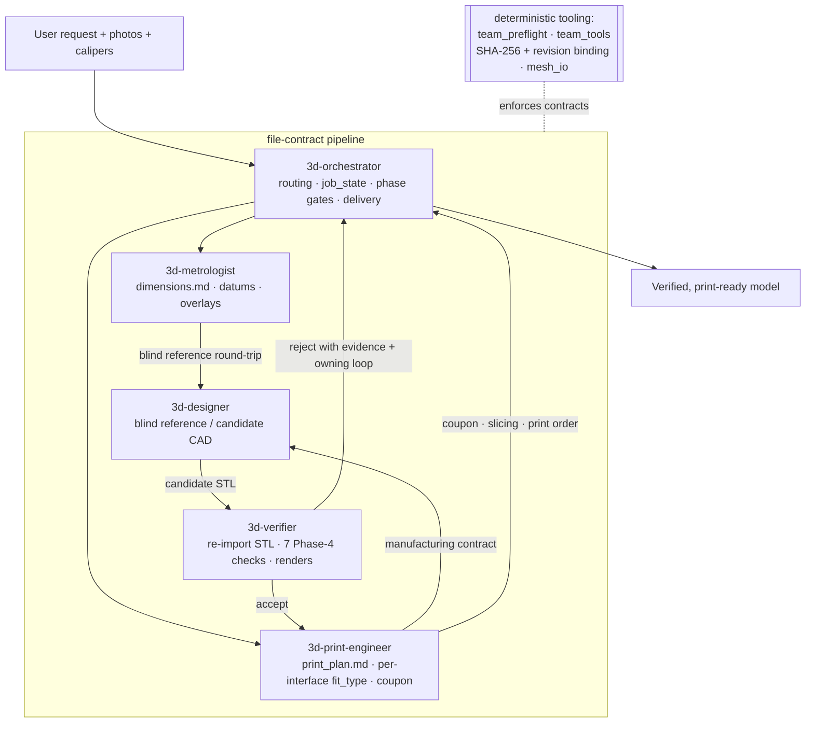

# 3d-modeling skill

A multi-agent, file-contract pipeline for designing **verified, print-ready 3D
models** from a plain-language request plus reference photos and caliper
measurements. It runs as [Claude Code](https://claude.com/claude-code) subagents,
backed by deterministic Python tooling that enforces contract structure,
artifact identity, dependency freshness, and repeatable geometric checks.

The guiding principle: **a passing software gate is necessary evidence, not proof
of correctness.** Agents own the engineering judgment (interpret photos, choose
datums, choose fit strategy, accept/reject a design); the tooling enforces the
things a machine can actually prove.

There are two ways in:

- **Solo monolith** (`skills/3d-modeling/`) — a single-agent skill for simple,
  single-part, non-fit-critical jobs. Invoke with `/3d-modeling`.
- **Team pipeline** (five role slices + an orchestrator) — for fit-critical,
  multi-part, or photo-reconstructed work where independent verification matters.
  Invoke with `/3d-orchestrator` (or let the orchestrator route).

## The five-role pipeline



Roles communicate **only** through project contract files and source evidence —
never chat summaries. The designer and verifier are always different fresh
contexts, and the verifier runs every check on the **exported STL re-imported**,
not the in-memory model.

- **Normative** runtime contract + gate schema:
  [`skills/3d-modeling/references/team-contracts-v4.md`](skills/3d-modeling/references/team-contracts-v4.md)
- Role charters + design rationale (historical):
  [`skills/team-design.md`](skills/team-design.md)

## Repository layout

```
skills/
  3d-modeling/            # solo monolith skill (SKILL.md) + all shared assets
    references/           #   FDM design, CadQuery/FreeCAD patterns, materials, printers, contracts
    scripts/              #   deterministic tooling + backend runners + tests
      team_tools/         #     contract-automation package (validate/hash/status/render)
  3d-orchestrator/        # \
  3d-metrologist/         #  |
  3d-designer/            #  |  five team role slices (each a SKILL.md)
  3d-verifier/            #  |
  3d-print-engineer/      # /
  team-design.md          # historical design doc
.claude/
  agents/3d-*.md          # Claude Code agent definitions (one per role)
```

## Install

### Dependencies

Core runtime (also all the tests need):

```bash
pip install trimesh numpy pillow
```

Optional extras, installed only when you use those backends (declared in
`pyproject.toml`):

| Extra     | Pulls in                         | Needed for                                   |
|-----------|----------------------------------|----------------------------------------------|
| `cad`     | cadquery (heavy OCP stack)       | `run_cadquery_model.py`, CadQuery patterns   |
| `render`  | pyrender, PyOpenGL               | `preview.py` offscreen renders               |
| `visual`  | pyrender, PyOpenGL, scipy, shapely | `overlay_photo.py`, `verify_visual.py`     |
| `bambu`   | lxml                             | `make_bambu_3mf.py` (3MF authoring/verify)   |

```bash
pip install -e ".[cad]"      # or .[visual], .[all], etc.
```

The **FreeCAD** backend additionally needs a FreeCAD desktop install reachable
via the FreeCAD MCP; it is not a pip dependency.

### Making Claude Code discover the skill + agents

- **Agents**: Claude Code auto-discovers agent definitions in a project's
  `.claude/agents/`. Opening *this* repo as your project exposes all five
  (`3d-orchestrator`, `3d-metrologist`, `3d-designer`, `3d-verifier`,
  `3d-print-engineer`). To use them from a *different* project, copy
  `.claude/agents/3d-*.md` into that project's `.claude/agents/` (or into
  `~/.claude/agents/` for all projects).
- **Skills**: place (or symlink) the skill folders under a discovered
  `.claude/skills/` directory, e.g.:

  ```bash
  mkdir -p ~/.claude/skills
  for s in 3d-modeling 3d-orchestrator 3d-metrologist 3d-designer 3d-verifier 3d-print-engineer; do
    ln -s "$PWD/skills/$s" ~/.claude/skills/$s
  done
  ```

  The five role slices reference shared assets by relative path
  (`../3d-modeling/references/...`, `../3d-modeling/scripts/...`), so keep the
  `skills/` subtree intact — do not flatten it.

## Quickstart

```
# In Claude Code, from a project that has a modeling job:
/3d-orchestrator     # fit-critical / multi-part / photo-reconstructed work
/3d-modeling         # simple single-part jobs (solo monolith)
```

Give the orchestrator the request plus any reference photos and caliper reads; it
routes solo-vs-team, dispatches specialists, and gates each phase on the
contract files.

Run the contract-automation CLI directly on a project directory:

```bash
cd skills/3d-modeling/scripts
python -m team_tools.contracts validate ./team_tools/examples/project_ok
```

## Running the tests

Tests and lint run with only the **core** deps installed (no cadquery / OCP):

```bash
pip install ruff pytest trimesh numpy pillow
ruff check skills/3d-modeling/scripts
pytest
```

`pyproject.toml` puts `skills/3d-modeling/scripts` on `pythonpath` so the suites
resolve their bare imports without an install step. Expected: **125 tests pass**
(`test_team_preflight` 49, `test_mesh_io` 5, `team_tools/test_contracts` 71) and
ruff clean. CI runs the same on Python 3.11 and 3.12
(`.github/workflows/ci.yml`).

## Changelog

See [CHANGELOG.md](CHANGELOG.md). The `0.1.0` entry summarizes the real-part
optimization program that produced this skill (blind agents, held-out oracles,
anti-overfit gates), the gate hardening, the contract-automation layer, the
H-03 fit-ownership change, and the two validated spec fixes.

## License

[MIT](LICENSE) © 2026 Idan.
