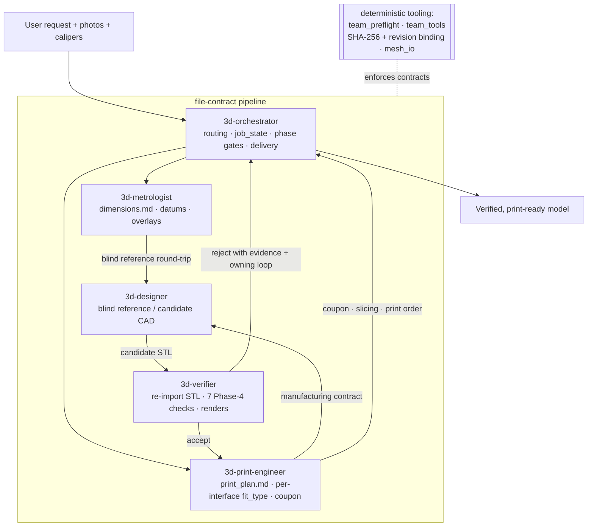
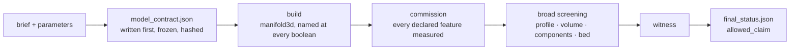

# 3d-modeling skill

Turns a plain-language request — plus reference photos and caliper reads when the
job needs them — into a **print-ready 3D model with a receipt that says exactly
what was checked and what was not**.

There are two ways through, and the job picks one:

- **The deterministic pipeline.** If the part is one of the certified templates
  and its parameters fall inside that template's certified domain, the whole job
  is one command, **zero model dispatches**, and finishes in under a second. A
  contract is written *before* any geometry, frozen, and hashed; the geometry is
  then measured against it.
- **The five-role file-contract pipeline.** For everything else: recreating a
  part from photos, reconciling against a real object, multi-part assemblies.
  Five agent roles coordinate through contract files on disk.

The guiding principle: **a passing software gate is necessary evidence, not proof
of correctness.** The tooling enforces only what a machine can actually prove,
and says so in the receipt when it cannot. Judgment — interpreting photos,
choosing datums, accepting a design — stays with agents and people.

Nothing is harness-specific. It ships as **one skill**; every tool is a plain
Python CLI.

- **Pipeline package:** [`scripts/pipeline/`](skills/3d-modeling/scripts/pipeline/)
- **Normative contract + gate schema:**
  [`team-contracts-v4.md`](skills/3d-modeling/references/team-contracts-v4.md)
- **Tool reference:** [`docs/tooling.md`](docs/tooling.md)

## Quickstart

### One command, no dispatches

Write a `job.json` naming a certified template and its parameters, then:

```bash
uv run design-tool run-job job_dir/
```

That is the whole job: contract, build, commission, screening, witness, status.
Measured cold, zero dispatches — a 300-vent enclosure (220 × 180 × 200 mm,
~4,500 faces) commissions in **0.78 s**.

The five certified templates and their domains:

| template | covers | backend |
|---|---|---|
| `c_clip` | a cable or pipe clip with a screw flange | trimesh + manifold3d |
| `box_shell` | a walled, open-topped box | trimesh + manifold3d |
| `l_bracket` | a right-angle bracket with fastener holes | trimesh + manifold3d |
| `vented_enclosure` | an enclosure with a vent grid and corner bosses | trimesh + manifold3d |
| `trim_ring` | a chamfered ring that drops into a panel hole | build123d |

A job outside every certified domain does not get built and quietly downgraded —
it routes to `FITTED` or `FULL` and says which, and why.

### Reviews are answered by re-running

A `CONSEQUENTIAL` job needs a bounded safety review, and `VERIFIED` needs
independent verification. Those are judgements about a part, so the CLI does not
invent them: it writes the evidence packet and stops.

```
design-tool: this job needs a safety review before it can finish.
  the evidence is written to  reviews/safety_packet.json
  write the answer to         reviews/safety_response.json
  then run the same command again.
```

Write the response and run the same command again. Answers are validated against
the same schema an in-process caller is held to, and the safety packet
deliberately excludes the verification report so the two cannot anchor on each
other.

### The five-role pipeline

Invoke the skill — in Claude Code, from a project that has a modeling job:

```
/3d-modeling
```

The skill *is* the orchestrator: it routes the job, and for work that needs the
full pipeline it dispatches the four specialists by handing each subagent the
matching file from `roles/`. Give it the request plus any reference photos and
caliper reads.

The contract-automation CLI also runs standalone on any project directory.
`examples/project_ok` is a complete set of v4 contracts that validates clean:

```bash
cd skills/3d-modeling/scripts
uv run python -m team_tools.contracts validate ./team_tools/examples/project_ok
```

## How the pipeline works



Three properties make the verification mean something:

- Roles communicate **only** through project contract files and source evidence —
  never chat summaries.
- The designer and the verifier are always **different fresh contexts**. Nothing
  accepts its own work.
- The verifier runs every check on the **exported STL, re-imported** — not on the
  in-memory model that produced it.

### The deterministic route



Four rules hold this together, and each exists because it failed once without it:

- **The contract is written before the geometry**, frozen at build start, and
  hashed. Every mandatory feature names five things: where its number came from,
  what it should measure, the tolerance, which check proves it, and what to do if
  that check cannot run. A contract missing any of them is refused before a
  single triangle is built.
- **The independence rule.** `expectations.py` imports `math` and nothing else,
  so an expectation and the geometry it judges cannot share a bug. Asserted by an
  import-graph test, not by a naming convention.
- **Fail-closed.** A check that cannot run escalates or fails per the contract.
  There is no `SKIP`, deliberately.
- **The boolean engine is named at every call.** Letting the library choose is
  how a run silently gets a different engine's answer.

### What screening can and cannot do

Broad screening looks for material the contract never declared — the failure mode
where every declared check passes and the part is still wrong.

**It is not currently calibrated, and the receipt says so.** Run
`python -m pipeline.corpus` for the live numbers; at the last measurement its
false-negative rate on defects *fused to the part* was **0.30**. A small boss
standing on a floor passes every check in the pipeline. So a job needs an
independent look before it can finish, and `final_status.json` states that in
`allowed_claim` rather than reading as though something had already looked.

Two things no calibration could license, and the receipt says these too:

- Screening **cannot prove a feature is absent**. A deleted countersink leaves a
  plain bore — smooth, plausible, and anomalous only against the curve the part
  should have had. Absence is the contract's job.
- Only the **Z axis** is profiled.

## Install

### Dependencies

Core runtime — every contract and mesh tool, and all but the optional-backend
tests (see [Running the tests](#running-the-tests) for the two extra test-only
packages):

```bash
uv sync --frozen
```

That resolves the lockfile, which is what the cache key hashes — two machines on
the same lock get the same geometry, and a machine whose lock moved misses rather
than serving bytes built against different versions. `pip install build123d
trimesh numpy pillow manifold3d` installs the same four packages if you are not
using uv, but nothing then pins what you got.

Optional extras, declared in `pyproject.toml` and installed only for the
backends you actually use:

| Extra           | Pulls in                                          | Needed for                                              |
|-----------------|---------------------------------------------------|---------------------------------------------------------|
| `section`       | scipy, networkx, shapely, rtree                   | `datum_features` / `finalize` datum blocks              |
| `render`        | pyrender, PyOpenGL                                | `preview.py` offscreen renders                          |
| `visual`        | pyrender, PyOpenGL, scipy, networkx, shapely, rtree | `overlay_photo.py`, `verify_visual.py`                |
| `bambu`         | lxml                                              | `make_bambu_3mf.py` (3MF authoring / verify)            |

```bash
uv sync --frozen              # the core: uv, build123d, trimesh, manifold3d
uv sync --frozen --group dev  # plus the test runner
# optional extras: .[render], .[section], .[visual], .[bambu], .[all]  ...
```


### Installing the skill

Opening *this* repo as your project is enough. To use it from another project,
copy or symlink the one skill folder where Claude Code discovers skills:

```bash
mkdir -p ~/.claude/skills
ln -s "$PWD/skills/3d-modeling" ~/.claude/skills/3d-modeling
```

All five roles are files in the skill's `roles/` directory, the orchestrator
included; `SKILL.md` is the router that names them. Everything resolves inside
that one folder, so it installs and moves as a unit — `python tools/build_skill.py`
packs exactly this tree into `3d-modeling.skill`.

## Repository layout

```
skills/
  3d-modeling/            # THE skill: router + roles + shared assets
    references/           #   FDM design, build123d/trimesh patterns, verification, materials, contracts
    scripts/              #   deterministic tooling + backend runners + tests
      pipeline/           #     the deterministic route: contract, build, commission,
                          #     screening, witness, status — `design-tool run-job`
        templates.py      #       the five certified templates and their domains
        expectations.py   #       closed forms; imports math and nothing else
        backends/         #       trimesh+manifold3d and build123d builders
        corpus.py         #       the mutation corpus the calibration gate reads
      team_tools/         #     contract-automation package (validate/hash/status)
      designer_toolkit/   #     export/measure/fit/coupon helpers for the designer role
    SKILL.md              #   the router: names the five roles and the shared assets
    roles/                #   orchestrator · metrologist · designer · print-engineer · verifier
  roles/                  # neutral role sources — edit these, then regenerate
.claude/agents/3d-*.md    # Claude Code agent definitions   \
tools/                    # gen_harness · build_skill · check_internal_links · bench
```

`skills/roles/*.md` are the source of truth. Edit a role there and run
`python tools/gen_harness.py`; CI fails on drift.

## Running the tests

Tests and lint run on the core stack — no GL context:

```bash
uv sync --frozen --group dev
uv run ruff check skills/3d-modeling/scripts
uv run pytest
```

The `bambu` extra adds multi-colour 3MF packing, which skips without it. `pyproject.toml` puts `skills/3d-modeling/scripts` on `pythonpath`,
so the suites resolve their bare imports with no install step.

The calibration corpus is a separate measurement, not a test assertion — it
builds every certified template, mutates each one, and reports what screening
caught:

```bash
uv run python -m pipeline.corpus
```

It exits non-zero while the gate fails, which it currently does. `gate`,
`screening_false_negative_rate`, `clean_parts_checked` and
`survivors_of_everything` are the fields worth reading.

CI ([`.github/workflows/ci.yml`](.github/workflows/ci.yml)) runs that on Python
3.11 and 3.12, then `gen_harness.py --check`, `check_internal_links.py` and
`build_skill.py`. A second job installs `.[section]` and runs the cross-section
tests, which skip on the core stack.

## For agents

Hand this to a coding agent to install the skill into a project:

```text
Set up the 3d-modeling skill (https://github.com/ghsi011/3d-modeling-skill) for this project.

1. Clone it outside this project, e.g. `git clone https://github.com/ghsi011/3d-modeling-skill.git ~/src/3d-modeling-skill`. If the clone already exists, `git pull` instead.
2. Install the tooling dependencies as the clone's README "Dependencies" section specifies: the core install first, extras only for what this job actually needs.
3. Install the skill as the clone's README "Installing the skill" section specifies. There is nothing to register per harness: `SKILL.md` is a router and the five roles are files beside it, so any runtime that can read a file and spawn a subagent can run it.
4. Verify: `pip install pytest` and run `pytest -q` inside the clone, report the pass/skip counts, then confirm `3d-orchestrator` is listed as an available agent here. Do not report success on an unverified step.

Then tell me: what you installed, what you skipped and why, and anything that failed. Do not guess versions or invent commands that are not in the repo's README or docs/tooling.md.
```

Once installed, the entry point is the orchestrator role — `/3d-orchestrator` in
Claude Code. `SKILL.md` itself is a router: it names the five roles and points at
the shared references, and the orchestrator reads its own charter like everyone
else.
Working notes for agents editing this repo live in [`AGENTS.md`](AGENTS.md); the
deterministic tool surfaces, their exact flags, and their exit-code contracts are
in [`docs/tooling.md`](docs/tooling.md).

## Changelog

See [CHANGELOG.md](CHANGELOG.md).

## License

[MIT](LICENSE) © 2026 Idan.
