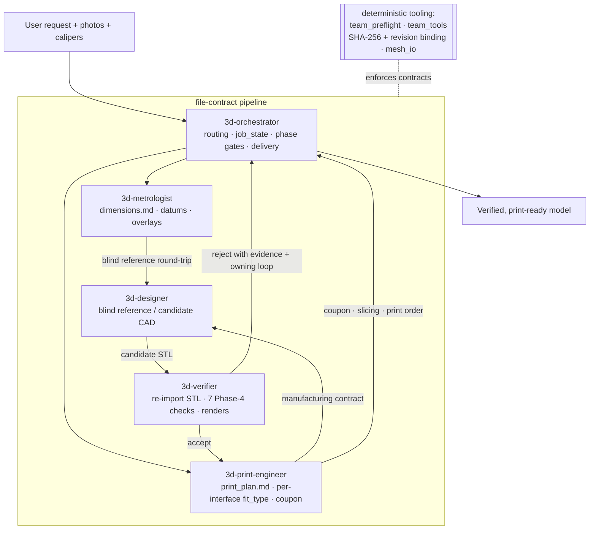
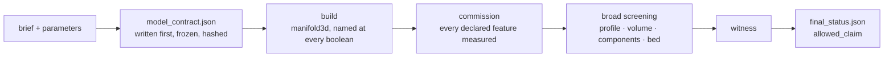

# 3d-modeling skill

Turns a plain-language request — plus reference photos and caliper reads when the
job needs them — into a **print-ready 3D model with a receipt that says exactly
what was checked and what was not**.

There are two ways through, and the job picks one:

- **The deterministic pipeline.** Route selection is independent of consequence.
  For a certified template inside its certified domain, a certified
  `INCONSEQUENTIAL` `DIRECT` job is one command with **zero model dispatches**;
  on the reference workstation the deterministic compute measures under a second
  for a certified template on the trimesh path. That figure is a measurement of
  one path, not a promise for every job — a build123d cold import or a job that
  carries a static interface check can cost several seconds or more. A certified
  `CONSEQUENTIAL` `DIRECT` job instead
  adds exactly one bounded safety review and no normal geometric verifier. A
  contract is written *before* any geometry, frozen, and hashed; the geometry is
  then measured against it.
- **The five-role file-contract pipeline.** For everything else: recreating a
  part from photos, reconciling against a real object, multi-part assemblies.
  A trusted imported or off-template solid is also a legitimate starting input
  when no evidence recovery is needed; record inherited and chosen dimensions
  separately. Five agent roles coordinate through contract files on disk.

The guiding principle: **a passing software gate is necessary evidence, not proof
of correctness.** The tooling enforces only what a machine can actually prove,
and says so in the receipt when it cannot. Judgment — interpreting photos,
choosing datums, accepting a design — stays with agents and people.

Nothing is harness-specific. It ships as **one skill**; every tool is a plain
Python CLI.

- **Pipeline package:** [`scripts/pipeline/`](skills/3d-modeling/scripts/pipeline/)
- **Normative contract + gate schema:**
  [`team-contracts-v4.md`](skills/3d-modeling/references/team-contracts-v4.md)
- **Tool reference:** [`docs/tooling.md`](docs/tooling.md)

This README describes what the skill does today. The intended end-state design is
[`ARCHITECTURE.md`](ARCHITECTURE.md), the incremental path to it is
[`ROADMAP.md`](ROADMAP.md), and accepted technical decisions are recorded in
[`docs/adr/`](docs/adr/). Neither of the first two describes current behaviour.
Confirmed defects that are not yet fixed are in
[`docs/defects.md`](docs/defects.md) — they describe current behaviour that is
wrong, which is neither a plan nor a decision.

## Quickstart

### Certified INCONSEQUENTIAL DIRECT: one command, no specialist calls

Write a `job.json` naming a certified template and its parameters, including the
required `printer`, `material`, `nozzle`, and `orientation` manufacturing inputs,
then:

```bash
uv run design-tool run-job job_dir/
```

That is the whole certified `INCONSEQUENTIAL` `DIRECT` job: contract, build,
commission, screening, witness, status. Measured cold on the reference
workstation for certified `INCONSEQUENTIAL` `DIRECT`: zero specialist calls — a
300-vent enclosure (220 × 180 × 200 mm, ~4,500 faces) commissions in **0.78 s**
on the trimesh path. Times are certified-template measurements on that machine,
not guarantees; a build123d template or a static interface check can cost more.

The five certified templates and their domains:

| template | covers | backend |
|---|---|---|
| `c_clip` | a cable or pipe clip with a screw flange | trimesh + manifold3d |
| `box_shell` | a walled, open-topped box | trimesh + manifold3d |
| `l_bracket` | a right-angle bracket with fastener holes | trimesh + manifold3d |
| `vented_enclosure` | an enclosure with a vent grid and corner bosses | trimesh + manifold3d |
| `trim_ring` | a chamfered ring that drops into a panel hole | build123d |

A job outside every certified domain does not get built and quietly downgraded —
it routes to `FITTED` or `FULL` and says which, and why.

### Reviews are answered by re-running

A certified `INCONSEQUENTIAL` `DIRECT` job has no review callback. A certified
`CONSEQUENTIAL` `DIRECT` job has exactly one bounded safety review and no normal
geometric verifier; `FITTED` retains its specification review, and `FULL` retains
specification plus independent verification. Those are judgements about a part,
so the CLI does not invent them: it writes the evidence packet and stops.

```
design-tool: this job needs a safety review before it can finish.
  the evidence is written to  reviews/safety_packet.json
  write the answer to         reviews/safety_response.json
  then run the same command again.
```

Write the response and run the same command again. Answers are validated against
the same schema an in-process caller is held to, and the safety packet
deliberately excludes the verification report so the two cannot anchor on each
other.

### Competing concepts are branches, not one job with two answers

When a job could plausibly be solved two ways — a screw-fastened bracket and a
snap-fit one — declare each as an **alternative**:

```bash
uv run design-tool branch project/ --from . --id snap-fit --reason "no fasteners to lose"
uv run design-tool run project/
uv run design-tool branch project/ --activate .        # back to the first concept
uv run design-tool branch project/ --disposition PREFERRED --of snap-fit \
    --basis PHYSICAL_TEST                              # and this one is the answer
```

Branching writes one row in `project.json` and **copies nothing**: the brief, the
requirements, the source artifacts and the evidence stay shared and are read by
reference, and only what differs — the proposal, the model, the artifacts, the
acceptance revision, the reviews and every receipt — lives under
`alternatives/<id>/`. Selecting one concept does not delete the other, and a
review answered for one is refused by the other rather than accepted: at the
instant a branch is created its sibling is a copy, so the contract, the artifacts
and the witnesses all hash the same, and the alternative's identity is what the
review envelope binds.

Each formulation carries a **disposition**, and all seven states do something.
`PREFERRED` is at most one per project and switching it demotes the previous
holder rather than deleting it; `FALLBACK` is a concept you are keeping ready,
still runnable, and `design-tool status` names it as the thing to fall back on
exactly when the current formulation has no claim it may make; `PAUSED` parks one
and keeps the instruction that says what to do on resuming; `REJECTED`,
`SUPERSEDED` and `MERGED` finish with one, clear its instruction and keep every
receipt it earned. Every state but the default has to say what it rests on.
Details and the exit contract are in [`docs/tooling.md`](docs/tooling.md).

A project that never branches pays nothing for this: no directory appears, no
payload gains a field, and every frozen contract hash is unchanged.

### The five-role pipeline

Invoke the skill — in Claude Code, from a project that has a modeling job:

```
/3d-modeling
```

The skill *is* the orchestrator: it routes the job, and for work that needs the
full pipeline it dispatches the four specialists by handing each subagent the
matching file from `roles/`. Give it the request plus any reference photos and
caliper reads.

The contract-automation CLI also runs standalone on any project directory.
`examples/project_ok` is a complete set of v4 contracts that validates clean:

```bash
cd skills/3d-modeling/scripts
uv run python -m team_tools.contracts validate ./team_tools/examples/project_ok
```

## How the pipeline works



Three properties make the verification mean something:

- Roles communicate **only** through project contract files and source evidence —
  never chat summaries.
- The designer and the verifier are always **different fresh contexts**. Nothing
  accepts its own work.
- The verifier runs every check on the **exported STL, re-imported** — not on the
  in-memory model that produced it.

### The deterministic route



Four rules hold this together, and each exists because it failed once without it:

- **The contract is written before the geometry**, frozen at build start, and
  hashed. Every mandatory feature names five things: where its number came from,
  what it should measure, the tolerance, which check proves it, and what to do if
  that check cannot run. A contract missing any of them is refused before a
  single triangle is built.
- **The independence rule.** `expectations.py` imports `math` and nothing else,
  so an expectation and the geometry it judges cannot share a bug. Asserted by an
  import-graph test, not by a naming convention.
- **Fail-closed.** A check that cannot run escalates or fails per the contract.
  There is no `SKIP`, deliberately.
- **The boolean engine is named at every call.** Letting the library choose is
  how a run silently gets a different engine's answer.

### What screening can and cannot do

Broad screening looks for material the contract never declared — the failure mode
where every declared check passes and the part is still wrong.

The screening corpus is a release measurement, not a correctness claim. Run
`uv run python -m pipeline.corpus` for the current rates and read its `gate` result.
A small boss standing on a floor can pass every declared check in the pipeline.
Until the screening gate has earned its threshold, a job needs an independent look
before it can finish; `final_status.json` records that state in `allowed_claim`
rather than reading as though something had already looked.

Two things no screening measurement could license, and the receipt says these too:

- Screening **cannot prove a feature is absent**. A deleted countersink leaves a
  plain bore — smooth, plausible, and anomalous only against the curve the part
  should have had. Absence is the contract's job.
- Only the **Z axis** is profiled.

## Install

### Dependencies

Runtime-only install (no test tooling — use `--group dev` when you need the test
runner):

```bash
uv sync --frozen --no-dev
```

That resolves the lockfile, which is what the cache key hashes — two machines on
the same lock get the same geometry, and a machine whose lock moved misses rather
than serving bytes built against different versions. `pip install` is never used;
everything goes through uv so the lockfile is the authoritative toolchain
identity.

Optional extras, declared in `pyproject.toml` and installed only for the
backends you actually use:

| Extra           | Pulls in                                          | Needed for                                              |
|-----------------|---------------------------------------------------|---------------------------------------------------------|
| `section`       | already core: scipy, networkx, shapely, rtree    | `datum_features` / `finalize` compatibility alias       |
| `render`        | pyrender, PyOpenGL                                | `preview.py` offscreen renders                          |
| `visual`        | pyrender, PyOpenGL, scipy, networkx, shapely, rtree | `overlay_photo.py`, `verify_visual.py`                |
| `bambu`         | lxml                                              | `make_bambu_3mf.py` (3MF authoring / verify)            |

```bash
uv sync --frozen --no-dev                    # core runtime + trimesh section stack
uv sync --frozen --no-dev --extra render     # core + render
uv sync --frozen --no-dev --extra section    # core + section
uv sync --frozen --no-dev --extra all        # core + everything
uv sync --frozen --group dev                 # core + dev (test runner), no optional extras
uv sync --frozen --all-extras                # everything including dev
```


### Installing the skill

Opening *this* repo as your project is enough. To use it from another project,
copy or symlink the one skill folder where Claude Code discovers skills:

```bash
mkdir -p ~/.claude/skills
ln -s "$PWD/skills/3d-modeling" ~/.claude/skills/3d-modeling
```

All five roles are files in the skill's `roles/` directory, the orchestrator
included; `SKILL.md` is the router that names them. Everything resolves inside
that one folder, so it installs and moves as a unit — `uv run python tools/build_skill.py`
packs exactly this tree into `3d-modeling.skill`.

## Repository layout

```
skills/
  3d-modeling/            # THE skill: router + roles + shared assets
    references/           #   FDM design, build123d/trimesh patterns, verification, materials, contracts
    scripts/              #   deterministic tooling + backend runners + tests
      pipeline/           #     the deterministic route: contract, build, commission,
                          #     screening, witness, status — `design-tool run-job`
        templates.py      #       the five certified templates and their domains
        expectations.py   #       closed forms; imports math and nothing else
        backends/         #       trimesh+manifold3d and build123d builders
        corpus.py         #       the mutation corpus that measures screening
      team_tools/         #     contract-automation package (validate/hash/status)
      designer_toolkit/   #     export/measure/fit/coupon helpers for the designer role
    SKILL.md              #   the router: names the five roles and the shared assets
    roles/                #   orchestrator · metrologist · designer · print-engineer · verifier
  roles/                  # neutral role sources — edit these, then regenerate
.claude/agents/3d-*.md    # Claude Code agent definitions   \
tools/                    # gen_harness · build_skill · check_internal_links · bench
  fixtures.py             #   the benchmark fixture manifest: evidence class,
                          #   licence, and the wall between a request and its answer
  test_diagnosis_l0.py    #   the L0 set — five artifacts, facts asserted not verdicts
  test_tiers.py           #   the commit gate's own guard, as a function
conftest.py               # the gate, enforced: no L0 test may start a child interpreter
benchmarks/heavy/         # L0-heavy — the component fixtures that cost a process.
                          # Outside testpaths, so a bare `pytest` cannot collect
                          # them; run before merge. See its README for the profile
benchmarks/fixtures/      # public request material — everything under a fixture's
                          # own directory is material an agent may read. Licence
                          # decides where the bytes live: the owner's own source
                          # geometry is vendored and recorded repo-relative;
                          # third-party geometry is never copied, and is
                          # referenced by absolute path and SHA-256
benchmarks/references/    # the answers, committed outside every fixture directory
                          # so walking up from a request cannot reach one
```

`skills/roles/*.md` are the source of truth. Edit a role there and run
`uv run python tools/gen_harness.py`; CI fails on drift.

## Running the tests

Tests and lint run on the core stack — no GL context:

```bash
uv sync --frozen --group dev
uv run ruff check skills/3d-modeling/scripts
uv run pytest
```

The `bambu` extra adds multi-colour 3MF packing, which skips without it. `pyproject.toml` puts `skills/3d-modeling/scripts` on `pythonpath`,
so the suites resolve their bare imports with no install step.

That command is the **commit gate**, and it runs in about a minute. It is not the
whole suite. Two more tiers run before merge and a bare `pytest` collects neither,
because `testpaths` is `skills/3d-modeling/scripts` and `tools` and they are in
neither — the same structural separation, at both joints:

```bash
uv run pytest                     # L0        ~1 m,  every push
uv run pytest benchmarks/heavy    # L0-heavy  ~13 m, pull requests
uv run pytest benchmarks/replays  # L1        ~1 m,  pull requests
```

These carried exact test counts until they did not: the commit gate was described
here as 838 tests long after it collected over 1200. A count in prose has no way to
notice itself going stale, and pinning one with a test would only make a number that
changes on every added fixture into a second thing to maintain — so the counts are
gone rather than corrected. `conftest.py`'s `L0_COLLECTED_CEILING` is the budget
that is actually enforced, and it is the one place a number belongs. Wall clock is
approximate on purpose: `ROADMAP.md` §4.4 records the same suite measuring 43.3 s
and then 76.9 s in one session, so a figure to the second here would be noise
wearing precision.

### The commit gate, and what it will not carry

The gate used to be 997 s against a five-second budget, because there was no tier
— one undifferentiated run. Profiling it per test found the cost in one place:
**194 of 1163 tests started a child interpreter and held 876 s of 1020 s**, at
about 1.6 s each, because a fresh interpreter that reaches `import trimesh` costs
that here. Those tests are the two command surfaces, the confined build boundary,
the packaging smokes; they now live in
[`benchmarks/heavy/`](benchmarks/heavy/README.md), which has the full profile and
the rule a new test follows.

Where a test is collected is structural. Whether it belongs there is *measured*:
[`conftest.py`](conftest.py) fails any L0 test that starts a child process — `git`
excepted, at ~45 ms a call — or that runs longer than five seconds, and names the
heavy directory in the message. A marker would be one forgotten decorator away
from a test silently leaving its tier; here the default is the gating tier and
forgetting costs a red test rather than lost coverage. `tools/test_tiers.py`
tests the decision as a function and `benchmarks/heavy/test_tiers_heavy.py` shows
it going red in a real session.

### The replay suite

`benchmarks/replays` holds recorded engineering jobs replayed end to end through
`design-tool` with no live AI call, and [`ROADMAP.md`](ROADMAP.md) section 4.4
budgets the tiers separately. No number means anything if one suite can run
inside another.

```bash
uv run pytest benchmarks/replays          # ~68 s, four recorded jobs
uv run python tools/replay.py --list
uv run python tools/replay.py --run modify-ball-flange-flat
uv run python tools/replay.py --record modify-ball-flange-flat   # re-freeze
```

One of the four is branched: `branch-knob-seat-fallback` plays three formulations
of one job through `design-tool branch`, `route` and `run` -- then reads what
each one's receipts currently support by calling `status.report` -- with the
brief and the requirements shared at the project root and every receipt under the
formulation that produced it.

Re-record only when a change legitimately moves an expectation, and put the diff
in the review — that diff is the point. The argument for what a replay asserts,
what it deliberately does not, and why a recorded review judgement is re-bound
rather than replayed verbatim is in `tools/replay.py`'s module docstring.

The screening corpus is a separate release measurement, not a test assertion — it
builds every certified template, mutates each one, and reports what screening
caught:

```bash
uv run python -m pipeline.corpus
```

It exits non-zero when the measured gate fails. `gate`,
`screening_false_negative_rate`, `clean_parts_checked` and
`survivors_of_everything` are the fields worth reading.

CI ([`.github/workflows/ci.yml`](.github/workflows/ci.yml)) runs that on Python
3.11 and 3.12 via `uv sync --frozen --all-extras`, then `uv run ruff check`,
the generated/stale-file scan, internal links, `uv run python tools/build_skill.py`,
`uv build --wheel`, and `uv run pytest` — with all optional dependencies
so the cross-section tests run rather than skip. That job runs on every push, with
a three-minute step timeout on the gate so the budget is enforced and not merely
recorded. A second job runs the heavy tier and then the replays, on pull requests
only and on one Python version: a replay compares a run against a recording of
the same pipeline, so running it twice measures the interpreter rather than the
job.

### Release surfaces

The Python wheel and the `.skill` archive are deliberately different products:

* `uv build --wheel` produces the runtime `pipeline`, `designer_toolkit`, and
  `team_tools` packages plus required sibling modules and the `design-tool`
  entry point. Test modules are excluded; role files, references, and the
  standalone skill launcher are not part of the wheel.
* `uv run python tools/build_skill.py` produces `3d-modeling.skill`, the
  installable agent bundle containing `SKILL.md`, roles, references, scripts,
  and its locked runtime project. Tests and local fixtures are excluded.

Release checks cover both surfaces: generated-file drift and links, deterministic
bundle bytes and SHA-256 equality, an extracted-bundle smoke from an external
working directory, and a wheel-installed `design-tool doctor` smoke.

## For agents

Hand this to a coding agent to install the skill into a project:

```text
Set up the 3d-modeling skill (https://github.com/ghsi011/3d-modeling-skill) for this project.

1. Clone it outside this project, e.g. `git clone https://github.com/ghsi011/3d-modeling-skill.git ~/src/3d-modeling-skill`. If the clone already exists, `git pull` instead.
2. Install the tooling dependencies as the clone's README "Dependencies" section specifies: the core install first, extras only for what this job actually needs.
3. Install the skill as the clone's README "Installing the skill" section specifies. There is nothing to register per harness: `SKILL.md` is a router and the five roles are files beside it, so any runtime that can read a file and spawn a subagent can run it.
4. Verify: `uv sync --frozen --group dev` and run `uv run pytest -q` inside the clone, report the pass/skip counts, then confirm `3d-orchestrator` is listed as an available agent here. Do not report success on an unverified step.

Then tell me: what you installed, what you skipped and why, and anything that failed. Do not guess versions or invent commands that are not in the repo's README or docs/tooling.md.
```

Once installed, the entry point is the orchestrator role — `/3d-orchestrator` in
Claude Code. `SKILL.md` itself is a router: it names the five roles and points at
the shared references, and the orchestrator reads its own charter like everyone
else.
Working notes for agents editing this repo live in [`AGENTS.md`](AGENTS.md); the
deterministic tool surfaces, their exact flags, and their exit-code contracts are
in [`docs/tooling.md`](docs/tooling.md).

## Changelog

See [CHANGELOG.md](CHANGELOG.md).

## License

[MIT](LICENSE) © 2026 Idan.
